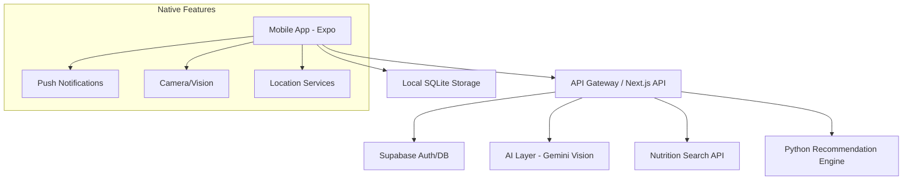

# Mobile Architecture Redesign: FoodCoach (iOS & Android)

## 1. Overview
The transition from a web-based application to a native mobile application (using Expo/React Native) is designed to leverage native features like Push Notifications, Camera access, and Background Location services, which are critical for the "Proactive Agent" and "Vision AI" features.

## 2. Tech Stack Redesign

### Frontend (Mobile)
- **Framework**: Expo (React Native) with SDK 50+.
- **Language**: TypeScript.
- **State Management**: React Query (Server state) + Zustand (Local state).
- **Styling**: NativeWind (Tailwind CSS for React Native) or Tamagui for premium UI.
- **Navigation**: Expo Router (File-based routing).
- **Native APIs**: 
  - `expo-camera`: For instant food photo recognition.
  - `expo-notifications`: For proactive interactions (Reminders, AI suggestions).
  - `expo-location`: For context-aware recommendations (nearby healthy food).
  - `expo-image-picker`: For uploading diary photos.

### Backend (API & Services)
- **API Layer**: Next.js API Routes (Serverless) or a dedicated Node.js/Express server. (Current preference: Keep Next.js for high-speed deployment as a headless API).
- **Database**: 
  - **Local**: `expo-sqlite` for offline caching and fast response.
  - **Cloud**: Supabase (PostgreSQL + Auth + Storage).
- **AI Engine**: 
  - **Vision**: Google Gemini 1.5 Pro/Flash for food image analysis.
  - **Recommendation**: Python-based engine (integrated via API or Edge Functions).

## 3. System Architecture

## 4. Key Improvements
1. **Proactive notifications**: Instead of waiting for a browser visit, the app will ping the user at meal times.
2. **Offline-First**: Users can log meals even without internet; sync happens in the background.
3. **Seamless UX**: High-performance camera integration for the vision feature.
4. **Haptic Feedback**: Premium mobile feel.

## 5. Migration Path
1. **Initialize Expo project** in `/mobile`.
2. **Shared Logic**: Extract business logic from `web/app/api` to shared utilities if possible, or keep as dedicated endpoints.
3. **UI Porting**: Re-implement web components using React Native primitives.
4. **Notification Setup**: Configure Expo Push Notifications.
